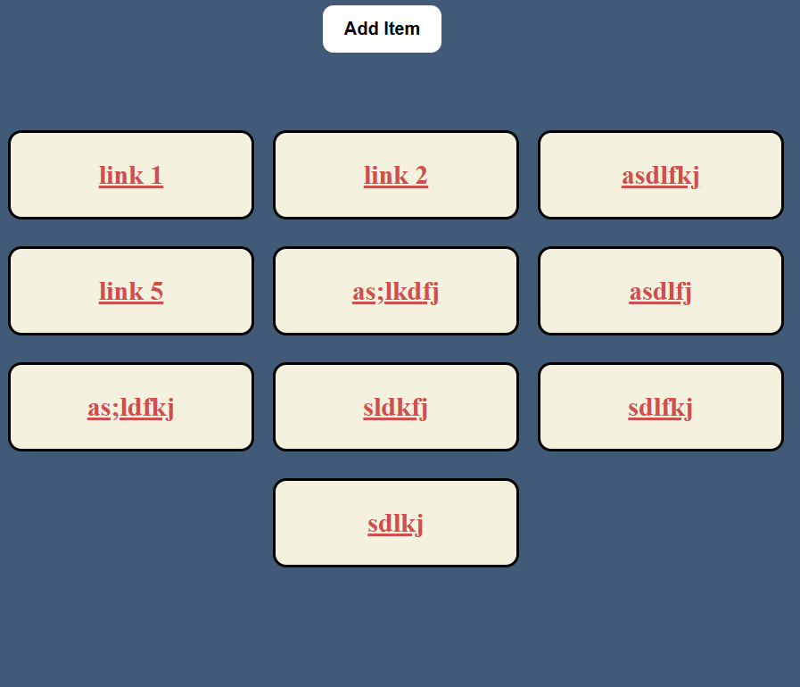

# 📚 Bookie – Reels Saver PWA

**Bookie** is a simple, mobile-friendly, and offline-capable web app to save your favorite Instagram Reels (or any links) along with custom titles. Built as a Progressive Web App (PWA), it works seamlessly on both desktop and mobile, even without an internet connection.

## 🔥 Features

- ✅ Save link + title pairs easily
- 💾 Persistent storage using `localStorage`
- ⚙️ Works 100% offline (thanks to Service Workers)
- 📱 Add to Home Screen like a native app
- 💻 Mobile + Desktop responsive design
- 🔐 Data stays private — nothing is stored online

---

## 📷 Preview

 

---

## 🚀 How to Use


1. **Open [https://bookie-saver.vercel.app] in your browser**
   

2. **Add to Home Screen** (on mobile)  
   To use it like an app, open it in your mobile browser and select:  
   `Add to Home Screen`

---

## 🧠 Tech Stack

- HTML, CSS, JavaScript
- `localStorage` for storing user data
- Service Worker + Manifest.json for PWA support

---

## 📦 Project Structure

```
bookie/
│
├── index.html          # Main HTML file
├── style.css           # Styles
├── app.js              # JavaScript logic (UI + localStorage)
├── manifest.json       # PWA metadata
├── sw.js               # Service Worker for offline support
├── icon-192.png        # App icon (192x192)
└── icon-512.png        # App icon (512x512)
```

---

## 🛡 Privacy

This app does **not** collect, sync, or share your data. Everything is stored locally in your own browser.

---

## 📌 Future Improvements

- 🔐 Firebase Authentication (for multi-device support)
- ☁️ Cloud sync using Firestore
- 🗂 Categories or folders
- 🔍 Search and filters

---

## 📄 License

MIT License — feel free to use and modify!

---

## 👨‍💻 Author

Made with ❤️ by [@pandey-prince](https://github.com/pandey-prince)
